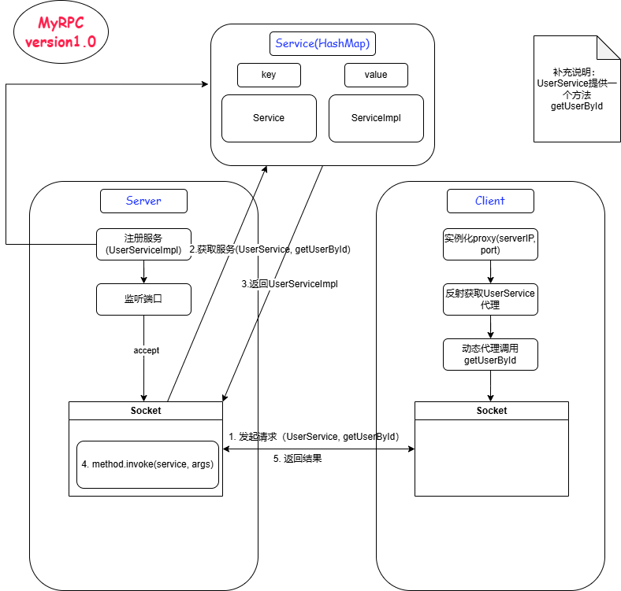

# MyRPC

## version1

### 功能
`集成consul和netty，实现服务注册和发现，并且能够进行简单的服务端和客户端的通信`

* 定义消息格式
* 服务端
  * 实现服务注册
  * 提供服务
* 客户端
  * 调用服务

### 架构图

#### 基本实现

#### 优化1：集成netty

### 开发步骤

#### 公共部分

1. 定义消息格式
   * pom引入lombok，通过注解来简化开发
     * 例如@Data可以自动生成getter和setter，@Builder可以链式填充对象属性，@Log可以避免通过System.out.println来输出
   * 定义request和response类
2. 简单定义一个服务 GetUserById
   * 定义一个User类型
   * 定义一个UserService接口
   * 实现UserServiceImpl
   
#### 客户端

* 定义发送连接的类IOClient.java：使用Socket和服务端进行连接
* 定义动态代理类Proxy.java：每次客户端尝试调用服务端的方法时触发invoke，使用IOClient.java与服务端连接
* 实现Client.java：实例化一个代理，并通过代理调用服务端提供的GetUserById方法

#### 服务端

* 声明rpc启动和终止接口 Server/server/RPCServer.java
* 实现rpc接口 Server/server/impl/SimpleRPCServer.java和Server/server/impl/ThreadPoolRPCRPCServer.java
* 实现服务注册和发现 Server/provider/ServiceProvider.java
*  Server/server/work/WorkThread.java
* 基本逻辑：通过servierprovider注册服务（此时的注册仅保存到本地hashmap中），然后监听端口，如果有连接，则通过workThread反射调用方法来获得response

#### 改进1： 集成netty

BIO -> NIO

* 客户端
  * handler - 继承SimpleChannelInboundHandler，并重写channelRead0和exceptionCaught方法
  * 启动类 - 继承ChannelInitializer，重写initChannel，定义消息格式、编解码器和handler；创建EventGroup和Bootstrap，配置Bootstrap，并连接远端生成ChannelFuture，关闭连接

* 服务端

  * handler - 与客户端类似
  * 启动类 - 第一步基本与客户端一致；创建bossGroup和workerGroup，配置ServerBootstrap，生成ChannelFuture等类似操作

  

#### 改进2： 集成zookeeper

作为服务注册中心，客户端可以从zookeeper中获取存活的服务的信息。

* pom添加依赖

* 客户端
  * 修改Proxy，不再需要指定ip和端口
  * 新建serviceCenter包，初始化zookeeper的客户端，并连接服务端
  * 修改NettyClient，从zookeeper获取服务的ip和端口
* 服务端
  * 新建registerCenter包，初始化zookeeper客户端，并连接服务端
  * 编写注册逻辑：注册服务根节点，即使服务提供者断开连接，仍能持久化存在，路径是MyRPC/servicename；注册服务实例节点，该节点是一个临时节点，一旦断开服务，节点自动删除，路径是MyRPC/servicename/serviceInstance
  * 修改serviceProvider，手动指明服务地址和端口，将其注册到zookeeper中
  * 修改server

